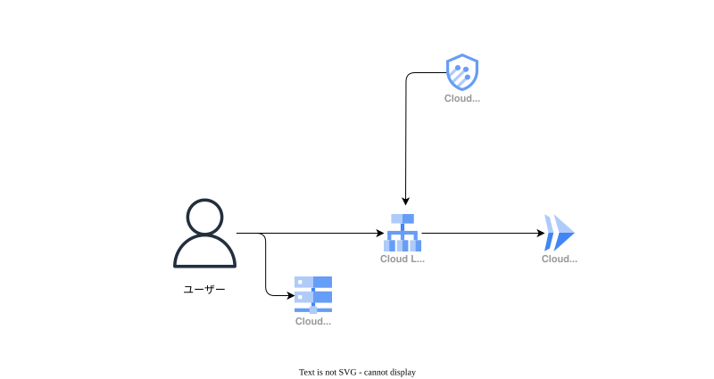

# Architecture 01: Cloud Run を External Application Load Balancer で公開する

Cloud Run だけでも HTTPS でサービスは公開できる。この構成では、独自ドメインで HTTPS を提供し、Cloud Armor を入口に置くために Global External Application Load Balancer を使う。対象は、主な利用者を日本国内と想定した小さな Web アプリケーションである。

Cloud Run のコンテナは `asia-northeast1` に置き、0 から 3 インスタンスまで自動で増減する。データベース、VPC 接続、利用者ごとの認証はこのテーマの範囲に含めない。公開経路をどう作り、どこで弾くかに絞った学習用の構成である。

この構成は常設しない。学習時に `terraform apply` で作成し、証明書とアクセス制御を確認したら `terraform destroy` で削除する。常時公開が必要なサービスの運用設計ではない。

## ケーススタディ

### 想定シナリオ

学習者は、ブラウザから Web アプリケーションを公開する経路を一時的に作る。`dev.mystudy.com` のような独自ドメインで HTTPS を提供し、アプリケーションの前で日本国外からのアクセスを拒否できることを確認する。

ブラウザへ Cloud Run 呼び出し用のサービスアカウント認証情報は配布しない。このため、この例では Cloud Run の IAM に `allUsers` を `roles/run.invoker` として付与する。ただし、インターネットから Cloud Run の既定 URL を直接呼び出す経路は許可せず、External Application Load Balancer を通るリクエストだけを受け付ける。

### 構成図

ユーザーは Cloud DNS の A レコードでロードバランサーのグローバル IP アドレスへ到達する。ポート 80 は 301 で HTTPS へリダイレクトし、ポート 443 は Certificate Manager の証明書を使って TLS を終端する。Cloud Armor が通過を許可したリクエストだけを、Serverless NEG 経由で Cloud Run に送る。

### 設計判断

#### ADR-001: External Application Load Balancer を公開入口にする

- 背景: Cloud Run 単体の既定 URL だけでは、独自ドメイン、HTTPS の入口、Cloud Armor のポリシーを一つの経路で扱えない。
- 決定: グローバル IPv4 アドレス、`EXTERNAL_MANAGED` のバックエンドサービス、リージョナル Serverless NEG を使う。HTTP は HTTPS へリダイレクトし、Certificate Manager の DNS 認証済み証明書を HTTPS プロキシに関連付ける。
- 比較: Cloud Run を直接公開する案は、Cloud Armor をバックエンドへ適用する今回の条件を満たさないため採らなかった。
- 影響: ロードバランサーは Cloud Run が 0 インスタンスでも時間課金される。独自ドメインの DNS 委任と、証明書が `ACTIVE` になるまでの確認を終えたら、学習用リソースを削除する。

Cloud Run を Serverless NEG のバックエンドにでき、独自ドメインでは静的 IP と DNS レコードが必要になる。[Cloud Run をバックエンドにした External Application Load Balancer の公式手順](https://cloud.google.com/load-balancing/docs/https/setting-up-https-serverless) と [Certificate Manager の DNS 認証手順](https://cloud.google.com/certificate-manager/docs/deploy-google-managed-dns-auth) を参照する。

#### ADR-002: Cloud Run の公開を LB 経由に限定する

- 背景: ブラウザからアクセスするフロントエンドに、サービスアカウントの秘密鍵を持たせる設計は採らない。一方で、`run.app` URL を経由して Cloud Armor を回避されるのは避けたい。
- 決定: Cloud Run の IAM は `allUsers` に `roles/run.invoker` を付与し、Ingress は `INGRESS_TRAFFIC_INTERNAL_LOAD_BALANCER` にする。最新の Ready Revision へ 100% のトラフィックを送る。
- 比較: Cloud Run の IAM 認証を必須にする案は、IAP やアプリケーション側のログイン機能を合わせて設計する必要がある。この Terraform にはそれらを含めないため採らなかった。
- 影響: この例では、利用者ごとの認証を扱わない。

`INGRESS_TRAFFIC_INTERNAL_LOAD_BALANCER` は、Cloud Run の `internal-and-cloud-load-balancing` に相当する。External Application Load Balancer 経由は許可し、インターネットから既定の `run.app` URL へ直接送るリクエストは拒否する。[Cloud Run の Ingress 制御](https://cloud.google.com/run/docs/securing/ingress) に仕様がある。

#### ADR-003: Cloud Armor で日本の IP アドレスだけを許可する

- 背景: 学習用の公開サービスでも、入口でアクセス元を絞る Cloud Armor の使い方を確認したい。
- 決定: 優先度 100 で `origin.region_code == 'JP'` に一致するリクエストを許可し、優先度 `2147483647` の既定ルールで残りを `deny(403)` にする。
- 比較: すべての国を許可するポリシーと静的 IP アドレスの許可リストは、この学習テーマの条件には合わないため採らなかった。
- 影響: 日本国外からの正規利用者は拒否される。逆に、日本の出口 IP を使うプロキシや VPN を利用するアクセスは通り得る。国判定は利用者認証の代わりにはならない。

`origin.region_code` はクライアント IP に対応する ISO 3166-1 alpha-2 の国または地域コードを条件に使える。[Cloud Armor のカスタムルール言語](https://cloud.google.com/armor/docs/rules-language-reference) を参照する。

### コスト試算

このテーマでは、3 時間だけ作成して確認後に削除する。月額ではなく、短時間の検証費用を基準にする。2026-08-15 に [Google Cloud Pricing Calculator](https://cloud.google.com/products/calculator) の入力項目と Cloud Armor の料金表を基に試算すると、リクエストを多めに 1,000 件、送信 50 MiB と見積もっても約 USD 0.11 である。実際の請求額ではない。

| 前提 | 値 | 費用への影響 |
| --- | --- | --- |
| リージョン | Cloud Run と Serverless NEG は `asia-northeast1` | Cloud Run の従量料金に反映される |
| 稼働時間 | 3 時間だけ作成し、確認後に削除 | 時間課金を約 USD 0.10 に抑える |
| ロードバランサー | グローバル転送ルール 2 本、3 時間 | 約 USD 0.075 |
| Cloud Armor | Standard のポリシー 1 件、ルール 2 件、3 時間、リクエスト 1,000 件 | 約 USD 0.030 |
| Cloud DNS | マネージドゾーン 1 件、3 時間、通常クエリ 1,000 件 | 約 USD 0.001 |
| 通信量 | 1 リクエストを受信 2 KiB、送信 50 KiB と仮定 | LB 処理と日本向けインターネット送信で USD 0.01 未満 |
| Cloud Run | 1 vCPU、512 MiB、最小インスタンス 0、リクエスト 1,000 件、平均 200 ms | ほかの利用で無料枠を使っていない前提では USD 0 |

Cloud Run は最小インスタンスが 0 のため、リクエストがなければコンテナの待機費用は発生しない。短時間の検証では、ほとんどがロードバランサーと Cloud Armor の時間課金である。証明書の発行に時間がかかる場合は、作成時間に応じてこの金額も増える。

参考として、同じ構成を 730 時間残すと約 USD 25.45 になる。リクエスト数を月 1,000 件へ減らしても、ロードバランサーと Cloud Armor の時間課金はほぼ変わらない。学習用のリソースを残したままにしない。

含めたものは External Application Load Balancer、Cloud Armor Standard、Cloud DNS、Cloud Run のリクエストベース課金と日本向けインターネット送信である。ドメイン登録費用、税、無料枠を超えた Cloud Logging と Cloud Monitoring、Cloud Armor Enterprise、通信量やリクエスト数の増加分は含めていない。料金は [Cloud Load Balancing](https://cloud.google.com/vpc/pricing#lb)、[Cloud Armor](https://cloud.google.com/armor/pricing)、[Cloud DNS](https://cloud.google.com/dns/pricing)、[Cloud Run](https://cloud.google.com/run/pricing) の公式料金表でも確認する。

### セキュリティと運用

#### 実装済みのこと

- IAM: `allUsers` に `roles/run.invoker` を付与している。これはブラウザからの公開アクセスを成立させるためであり、Cloud Run 自体を直接インターネットへ公開する指定ではない。Ingress が External Application Load Balancer 経由を要求する。
- TLS と名前解決: Certificate Manager の DNS 認証、証明書マップ、Cloud DNS の A レコードと CNAME レコードを Terraform で作る。SSL Policy は `MODERN`、最小 TLS バージョンは 1.2 にしている。
- 入口の制限: Cloud Armor は `origin.region_code == 'JP'` を許可し、それ以外を 403 にする。バックエンドサービスにはこのポリシーを関連付けている。

#### 確認と削除

- HTTP でアクセスし、HTTPS へリダイレクトされることを確認する。
- 日本の IP アドレスから HTTPS で到達でき、日本国外の IP アドレスでは Cloud Armor が 403 を返すことを確認する。
- Cloud Run の既定 URL を直接呼び出しても、インターネットからは到達できないことを確認する。
- 確認後に `terraform destroy` を実行する。Cloud Run、ロードバランサー、Cloud Armor、Cloud DNS ゾーン、証明書など、この Terraform が管理するリソースを削除する。ドメイン登録事業者のネームサーバー設定は Terraform 管理外なので、削除後の扱いを事前に確認する。

#### テーマの範囲

このテーマは、Cloud Run を External Application Load Balancer のバックエンドにし、HTTPS、Ingress、Cloud Armor の公開経路を確認するためのものだ。継続監視、高可用性、利用者ごとの認証は扱わない。未実装の作業ではなく、別のテーマで扱う範囲として切り分ける。

### コード

- [Terraform の対象フォルダ](https://github.com/MasanaoAsato/google-cloud-learning/tree/main/architectures/01)
- [terraform-docs 出力](./README_TERRAFORM_DOCS.md)
- 主要なモジュール: [`main`](./main)、[`cloud_run`](./modules/cloud_run)、[`load_balancer`](./modules/load_balancer)、[`cloud_armor`](./modules/cloud_armor)、[`cloud_dns`](./modules/cloud_dns)

Cloud Run には `INGRESS_TRAFFIC_INTERNAL_LOAD_BALANCER`、1 vCPU、512 MiB、0 から 3 インスタンス、30 秒のタイムアウトを指定している。ロードバランサーには HTTPS バックエンド、Serverless NEG、HTTP から HTTPS へのリダイレクト、Cloud Armor を設定している。設定値は各モジュールの Terraform と上記の terraform-docs 出力で確認できる。

### 学びと改善余地

この構成で分かるのは、Cloud Run をスケールゼロにしても公開入口まで無料になるわけではないことだ。独自ドメイン、TLS、Cloud Armor を一つの入口に集めると、ロードバランサーと Cloud Armor に時間課金が発生する。学習では、確認後に削除するところまでを手順に含める。

また、`INGRESS_TRAFFIC_INTERNAL_ONLY` と `INGRESS_TRAFFIC_INTERNAL_LOAD_BALANCER` は似ていても用途が異なる。External Application Load Balancer を使うこの構成では後者が必要であり、Ingress の値を間違えると LB から Cloud Run へ到達できない。Cloud Armor の国コード条件も、利用者を本人だと確認する仕組みではない。この制約までを確認する。
